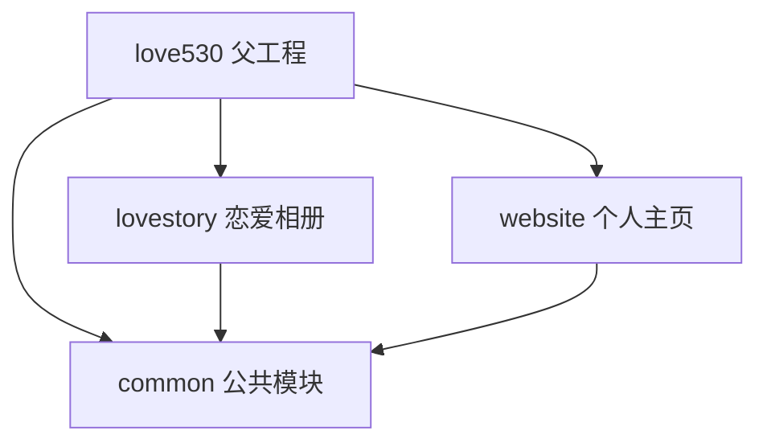

# 项目规划

> [!abstract] love5000 项目总览
> Java 8 + Spring Boot 2.6.13 的 Maven 多模块项目，父工程 `love530`，包含三个子模块：`common`、`lovestory`、`website`。

## 当前状态

- [x] 项目基础架构搭建（Maven 多模块）
- [x] `common` 公共模块（OSS、认证）
- [x] `lovestory` 恋爱相册服务
- [x] `website` 个人主页/博客服务
- [ ] 待补充...

---

## 模块结构



---

## AGENTS.md 文件索引

本项目包含 4 个 AGENTS.md 文件，分布于各模块中：

### 1. 根项目 AGENTS.md

![[AGENTS.md]]

---

### 2. common 公共模块

![[common/AGENTS.md]]

---

### 3. lovestory 恋爱相册服务

![[lovestory/AGENTS.md]]

---

### 4. website 个人主页服务

![[website/AGENTS.md]]

---

## 核心技术栈

| 类别 | 技术 |
|---|---|
| 语言 | Java 8 |
| 构建工具 | Maven |
| 后端框架 | Spring Boot 2.6.13 |
| Web | Spring MVC |
| 数据库 | MySQL |
| 数据访问 | Spring JDBC / JdbcTemplate |
| 连接池 | Alibaba Druid |
| 对象存储 | Aliyun OSS SDK |
| 测试 | JUnit 5 + Spring Boot Test |

## 快速命令

```bash
# 全量编译测试
mvn clean test

# 启动 lovestory（端口 8081）
mvn -pl lovestory -am spring-boot:run -Dspring-boot.run.main-class=com.ycxandwuqian.love.LovestoryApplication

# 启动 website（端口 8080）
mvn -pl website -am spring-boot:run
```

## 参考链接

- [[AGENTS.md]]
- [[common/AGENTS.md]]
- [[lovestory/AGENTS.md]]
- [[website/AGENTS.md]]
